# 📱 Be-Trendy Mobile App

**E-commerce mobile solution** combining:
- **Frontend:** Ionic  
- **Backend:** Django + MongoDB  

---

## 📱 App Screenshots

### 🔐 Authentication Interface

<div align="center">
  <table>
    <tr>
      <td align="center">
        <br/>
        <b>Splash Screen</b><br/>
      </td>
      <td align="center">
        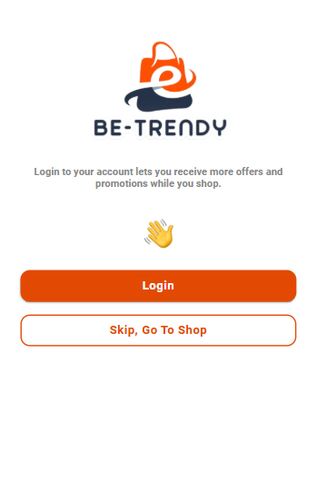<br/>
        <b>Welcome Screen</b><br/>
      </td>
      <td align="center">
        <br/>
        <b>Newsletter Subscription</b><br/>
      </td>
     <td align="center">
        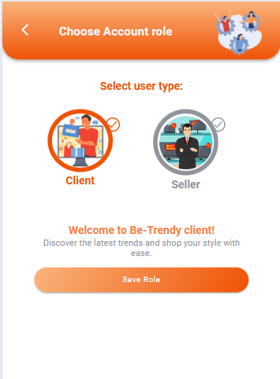<br/>
        <b>Role Selection</b><br/>
      </td>
      <td align="center">
        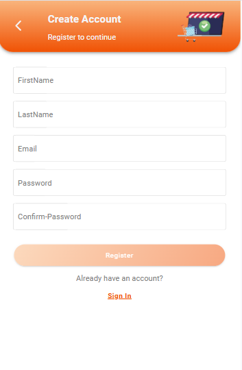<br/>
        <b>Registration</b><br/>
      </td>
    </tr>
    <tr>
      <td align="center">
        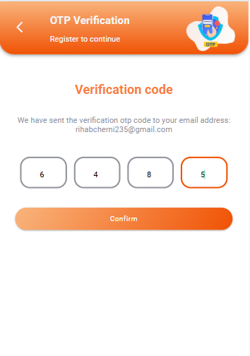<br/>
        <b>OTP Verification</b><br/>
      </td>
    <td align="center">
          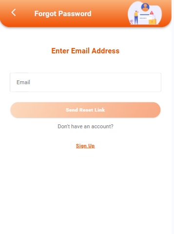<br/>
          <b>Forgot Password</b><br/>
        </td>
     <td align="center">
        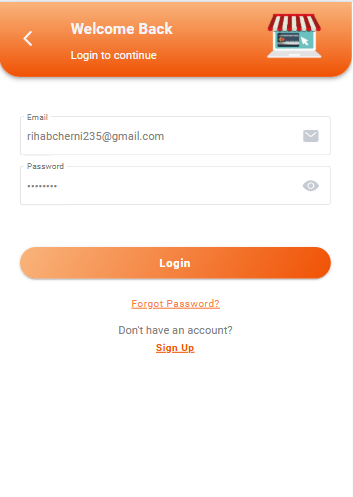<br/>
        <b>Login Screen</b><br/>
      </td>
      <td align="center">
        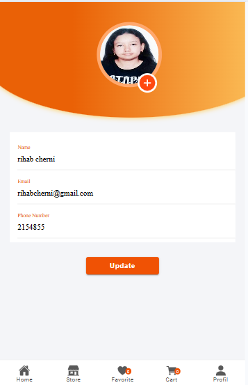<br/>
        <b>User Profile</b><br/>
      </td>
       <td align="center">
        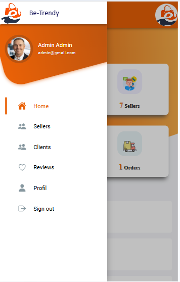<br/>
        <b>Menu</b><br/>
      </td>
    </tr>
  </table>
</div>

### 👤 Client Interface

#### 🛍️ Shopping Experience
  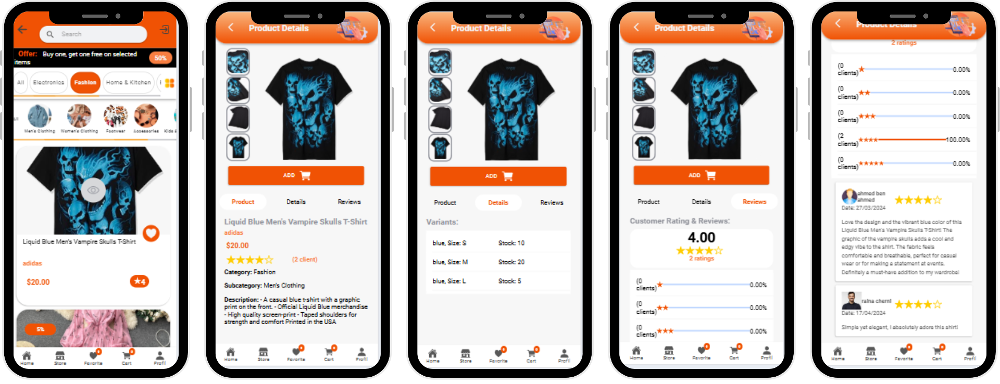

<div align="center">
  <table>
    <tr>
      <td align="center">
        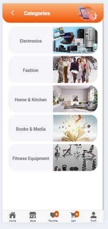
        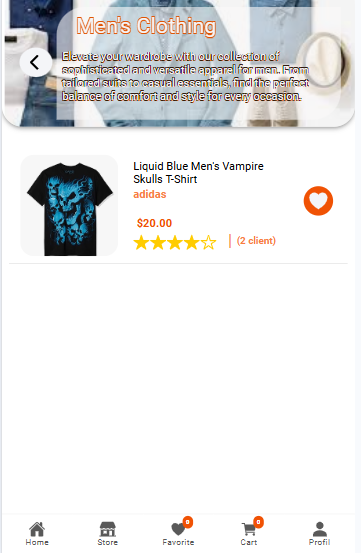
        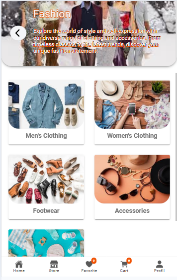<br/>
        <b>Category Filter</b><br/>
      </td>
      <td align="center">
        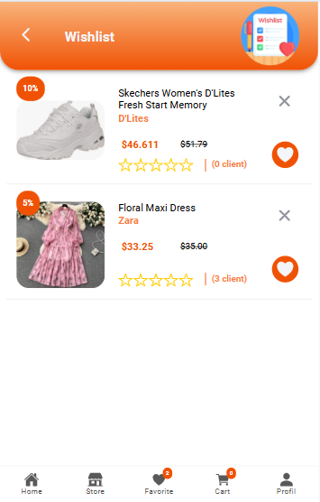<br/>
        <b>Wishlist</b><br/>
      </td>
    </tr>
  </table>
</div>

#### 🛒 Cart & Checkout
<div align="center">
  <table>
    <tr>
      <td align="center">
        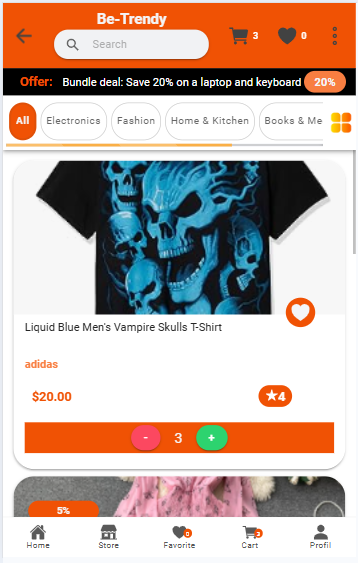
        <br/>
        <b>Shopping Cart</b><br/>
        <small>Manage your cart items</small>
      </td>
      <td align="center">
        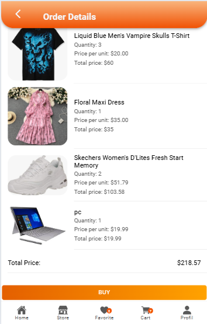<br/>
        <b>Checkout Screen</b><br/>
        <small>Review order summary</small>
      </td>
      <td align="center">
        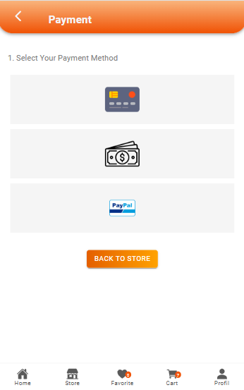
        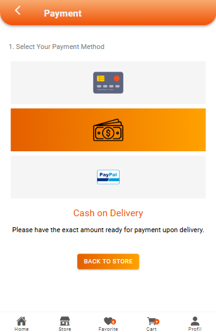
        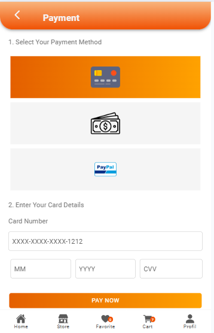<br/>
        <b>Payment Methods</b><br/>
        <small>Select payment options</small>
      </td>
    </tr>
  </table>
</div>

### 🏪 Seller Interface

<div align="center">
  <table>
    <tr>
      <td align="center">
        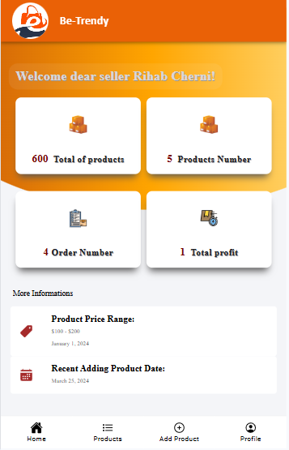<br/>
        <b>Seller Dashboard</b><br/>
      </td>
      <td align="center">
        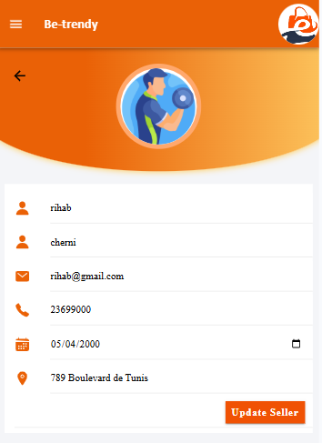<br/>
        <b>Seller Profile</b><br/>
      </td>
        <td align="center">
        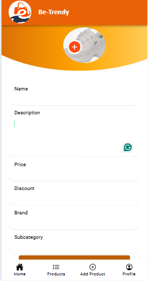<br/>
        <b>Add Product</b><br/>
      </td>
    </tr>
  </table>
</div>

### ⚙️ Admin Interface

#### 🎛️ Admin Dashboard
<div align="center">
  <table>
    <tr>
      <td align="center">
        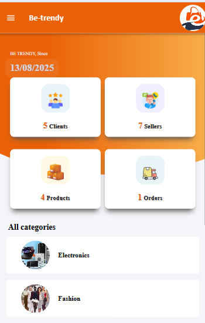<br/>
        <b>Admin Dashboard</b><br/>
      </td>
      <td align="center">
        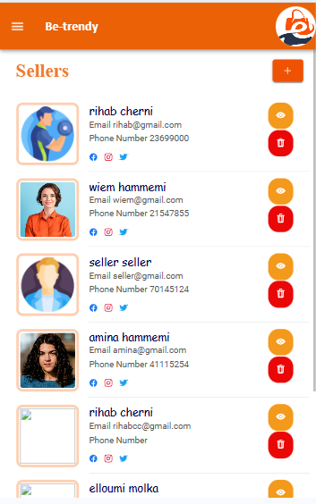<br/>
        <b>Sellers List</b><br/>
      </td>
            <td align="center">
        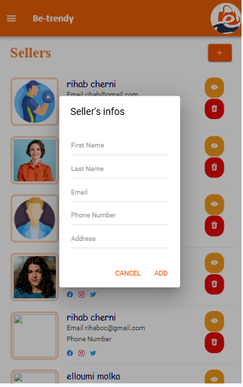<br/>
        <b>User Management</b><br/>
      </td>
    </tr>
  </table>
</div>
---

## ✨ Features

### Frontend (Ionic)
- 🔐 **User Authentication** – Registration, login, and profile management
- 👤 **Multi-Role System** – Client, Seller, and Admin interfaces
- 🛍 **Product Catalog** – Browse trendy items with images, prices, and details
- 🔍 **Advanced Search & Filters** – Find products by category, price, and ratings
- 🛒 **Shopping Cart** – Add, remove, and update cart items
- 📦 **Order Tracking** – View order status in real-time
- 💳 **Payment Integration** – Secure online transactions
- ❤️ **Wishlist** – Save favorite products for later
- 🏪 **Seller Dashboard** – Manage products and orders
- ⚙️ **Admin Panel** – Complete platform administration
- 📱 **Responsive Design** – Optimized for mobile devices
- 🔔 **Push Notifications** – Order updates and promotional offers

### Backend (Django + MongoDB)
- 🌐 **RESTful API** for frontend communication
- 🔐 **Secure Authentication & Authorization** (JWT)
- 👥 **Role-Based Access Control** (RBAC)
- 📦 **Product Management** (CRUD operations)
- 🛒 **Order Management** – Complete order lifecycle
- 👤 **Multi-User System** – Clients, Sellers, Admins
- 💾 **MongoDB Storage** for scalability and performance
- 📊 **Analytics Dashboard** – Sales and user metrics
- 🛡 **Security Best Practices** to protect sensitive data
- 🚀 **API Rate Limiting** and performance optimization

## 🏗️ Architecture

```
┌─────────────────┐    ┌─────────────────┐    ┌─────────────────┐
│                 │    │                 │    │                 │
│  Ionic Frontend │────│  Django Backend │────│  MongoDB        │
│  (Mobile App)   │    │  (REST API)     │    │  (Database)     │
│                 │    │                 │    │                 │
└─────────────────┘    └─────────────────┘    └─────────────────┘
        │                        │
        │                        │
    ┌───▼────┐              ┌────▼────┐
    │ Client │              │  Admin  │
    │ Seller │              │  Panel  │
    │ Admin  │              │   API   │
    └────────┘              └─────────┘
```

### Technology Stack

**Frontend (Mobile App)**
- **Ionic**: Cross-platform mobile framework
- **Angular**: Frontend framework
- **TypeScript**: Programming language
- **Capacitor**: Native bridge for mobile features

**Backend (API Server)**
- **Django**: Python web framework
- **Django REST Framework**: API development
- **JWT**: Authentication tokens

**Database**
- **MongoDB**: NoSQL document database

## 🛠 Installation & Setup

### Prerequisites
- **Node.js** (v16 or higher)
- **Python** (v3.9 or higher)
- **MongoDB** (v5.0 or higher)
- **Ionic CLI**
- **Git**

### 1️⃣ Clone the repository
```bash
git clone https://github.com/rihabcherni/BeTrendy-mobile.git
cd BeTrendy-mobile
```

### 2️⃣ Setup Frontend (Ionic)

```bash
cd frontend
npm install

# Install Ionic CLI globally (if not already installed)
npm install -g @ionic/cli

# Configure API endpoint in src/environments/environment.ts
# export const environment = {
#   production: false,
#   apiUrl: 'http://localhost:8000/api'
# };

# Start development server
ionic serve
```

Access the app via: **[http://localhost:8100](http://localhost:8100)**

### 3️⃣ Setup Backend (Django + MongoDB)

```bash
cd backend

# Create virtual environment
python -m venv venv
source venv/bin/activate  # On Windows: venv\Scripts\activate

# Install dependencies
pip install -r requirements.txt

# Apply migrations
python manage.py migrate

# Create superuser for admin access
python manage.py createsuperuser

# Start development server
python manage.py runserver
```

Access the API via: **[http://localhost:8000](http://localhost:8000)**  
Access admin panel via: **[http://localhost:8000/admin](http://localhost:8000/admin)**

### 4️⃣ MongoDB Setup

```bash
# Start MongoDB service
sudo systemctl start mongod  # On Linux
brew services start mongodb  # On macOS

# Or using Docker
docker run -d -p 27017:27017 --name mongodb mongo:latest
```

## 📱 Mobile Development

### Build for Mobile Platforms

```bash
# Navigate to frontend directory
cd frontend

# Add mobile platforms
ionic capacitor add ios
ionic capacitor add android

# Build the app
ionic build --prod

# Sync with mobile platforms
ionic capacitor sync

# Open in native IDEs
ionic capacitor open ios      # Opens Xcode
ionic capacitor open android  # Opens Android Studio
```

---

## 🧪 Testing

### Frontend Testing
```bash
cd frontend
npm run test
npm run e2e
```

### Backend Testing
```bash
cd backend
python manage.py test
```

---

## 🚀 Usage

### For Clients
1. **Download & Install** the mobile app
2. **Create Account** or sign in with existing credentials
3. **Browse Products** and explore different categories
4. **Add to Cart** and proceed to secure checkout
5. **Track Orders** in real-time through the app

### For Sellers
1. **Register** as a seller and wait for admin approval
2. **Access Seller Dashboard** to manage your store
3. **Add Products** with detailed descriptions and images
4. **Manage Inventory** and track stock levels
5. **Process Orders** and handle customer requests

### For Administrators
1. **Access Admin Panel** at `http://localhost:8000/admin`
2. **Login** with superuser credentials
3. **Manage Users** - Approve sellers and handle user issues
4. **Monitor Products** - Review and moderate content
5. **View Analytics** - Track platform performance and sales

---

## 👥 Contributors

- **Rihab Cherni** 
- **Molka Elloumi**
- **Wiem Hammemi** 

---

<div align="center">
  <p><strong>Made with ❤️ by the Be-Trendy team</strong></p>
  <p><em>A comprehensive e-commerce solution for the modern mobile era</em></p>
</div>