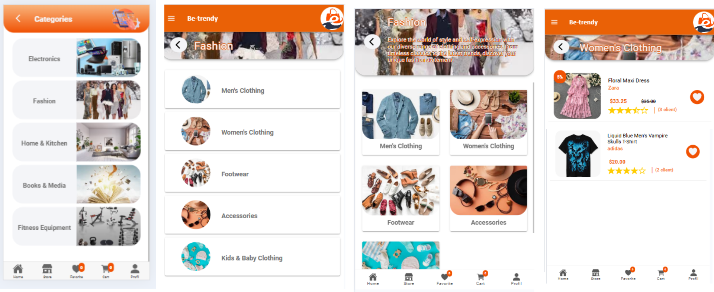

# Be-Trendy
Cross-platform e-commerce mobile app built with Ionic, Angular, Django, and MongoDB, featuring multi-role management for clients, sellers, and admins. Enables secure authentication, product catalog browsing, shopping cart, wishlist, and complete order lifecycle management.

## Features
- **User Authentication** – Registration, login, and profile management
- **Multi-Role System** – Client, Seller, and Admin interfaces
- **Product Catalog** – Browse trendy items with images, prices, and details
- **Advanced Search & Filters** – Find products by category, price, and ratings
- **Shopping Cart** – Add, remove, and update cart items
- **Wishlist** – Save favorite products for later
- **Seller Dashboard** – Manage products and orders
- **Responsive Design** – Optimized for mobile devices
- **RESTful API** for frontend communication
- **Secure Authentication & Authorization** (JWT)
- **Product Management** (CRUD operations)
- **Order Management** – Complete order lifecycle

---

## Design Prototype  

Check out the **Figma design** of the Be-Trendy Mobile App here:  
👉 [Figma Be-Trendy E-commerce App](https://www.figma.com/design/DQMjL3EY0F8xQIcQf271rq/be-trendy-e-commerce-ionic-Mobile-App?node-id=0-1&p=f&t=csBGsgmDUgzSZA97-0)

## App Screenshots

### Authentication Interface

<div align="center">
  <table>
    <tr>
      <td align="center">
        <br/>
        <b>Splash Screen</b><br/>
      </td>
      <td align="center">
        <br/>
        <b>Welcome Screen</b><br/>
      </td>
      <td align="center">
        <br/>
        <b>Newsletter Subscription</b><br/>
      </td>
     <td align="center">
        <br/>
        <b>Role Selection</b><br/>
      </td>
      <td align="center">
        <br/>
        <b>Registration</b><br/>
      </td>
    </tr>
    <tr>
      <td align="center">
        <br/>
        <b>OTP Verification</b><br/>
      </td>
    <td align="center">
          <br/>
          <b>Forgot Password</b><br/>
        </td>
     <td align="center">
        <br/>
        <b>Login Screen</b><br/>
      </td>
      <td align="center">
        <br/>
        <b>User Profile</b><br/>
      </td>
       <td align="center">
        <br/>
        <b>Menu</b><br/>
      </td>
    </tr>
  </table>
</div>

### Client Interface

<div align="center">
  <table>
    <tr>
     <td align="center" colspan="2">
        
        <b>Shopping Experience</b><br/>
      </td>
    </tr>
    <tr>
      <td align="center">
        
        <b>Category Filter</b><br/>
      </td>
      <td align="center">
        <br/>
        <b>Wishlist</b><br/>
      </td>
    </tr>
    <tr>
      <td align="center" colspan="2">
        <br/>
        <b>Shopping Cart & order summary</b>
      </td>
    </tr>
    <tr>
      <td align="center" colspan="2">
        <br/>
        <b>Payment Methods</b><br/>
      </td>
    </tr>
  </table>
</div>

### Seller Interface
<div align="center">
  <table>
    <tr>
      <td align="center">
        <br/>
        <b>Seller Dashboard</b><br/>
      </td>
      <td align="center">
        <br/>
        <b>Seller Profile</b><br/>
      </td>
        <td align="center">
        <br/>
        <b>Add Product</b><br/>
      </td>
    </tr>
  </table>
</div>

### Admin Interface
<div align="center">
  <table>
    <tr>
      <td align="center">
        <br/>
        <b>Admin Dashboard</b><br/>
      </td>
      <td align="center">
        <br/>
        <b>Sellers List</b><br/>
      </td>
            <td align="center">
        <br/>
        <b>User Management</b><br/>
      </td>
    </tr>
  </table>
</div>

---

### Technology Stack

<table>
  <tr>
    <th>Frontend (Mobile App)</th>
    <th>Backend (API Server)</th>
    <th>Database</th>
  </tr>
  <tr>
    <td>
      - Ionic: Cross-platform mobile framework <br/>
      - Angular: Frontend framework <br/>
      - TypeScript: Programming language
    </td>
    <td>
      - Django: Python web framework <br/>
      - Django REST Framework: API development <br/>
      - JWT: Authentication tokens
    </td>
    <td>
      - MongoDB: NoSQL document database
    </td>
  </tr>
</table>

## Installation & Setup

### Prerequisites
- **Node.js** (v16 or higher)
- **Python** (v3.9 or higher)
- **MongoDB** (v5.0 or higher)
- **Ionic CLI**
- **Git**

### 1️⃣ Clone the repository
```bash
git clone https://github.com/rihabcherni/BeTrendy-mobile.git
cd BeTrendy-mobile
```

### 2️⃣ Setup Frontend (Ionic)

```bash
cd frontend
npm install
npm install -g @ionic/cli
ionic serve
```

Access the app via: **[http://localhost:8100](http://localhost:8100)**

### 3️⃣ Setup Backend (Django + MongoDB)

```bash
cd backend
python -m venv venv
source venv/bin/activate  # On Windows: venv\Scripts\activate
pip install -r requirements.txt
python manage.py migrate
python manage.py createsuperuser
python manage.py runserver
```
Access the API via: **[http://localhost:8000](http://localhost:8000)**  

---

## Contributors

- **Rihab Cherni** 
- **Molka Elloumi**
- **Wiem Hammemi** 
<div align="center">
  <p><strong>Made with ❤️ by the Be-Trendy team</strong></p>

</div>
